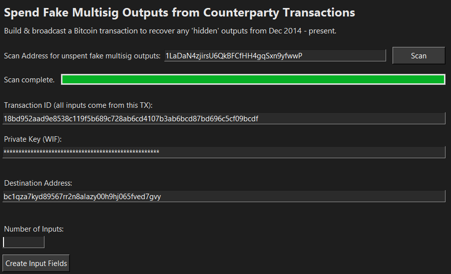
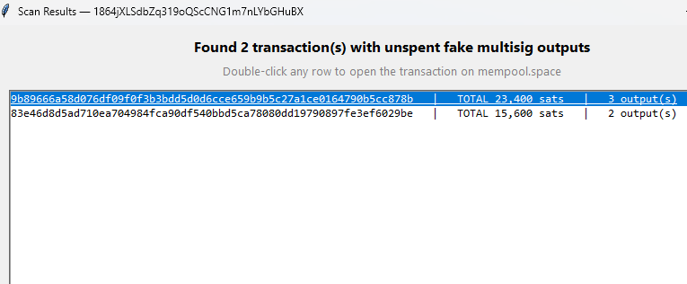
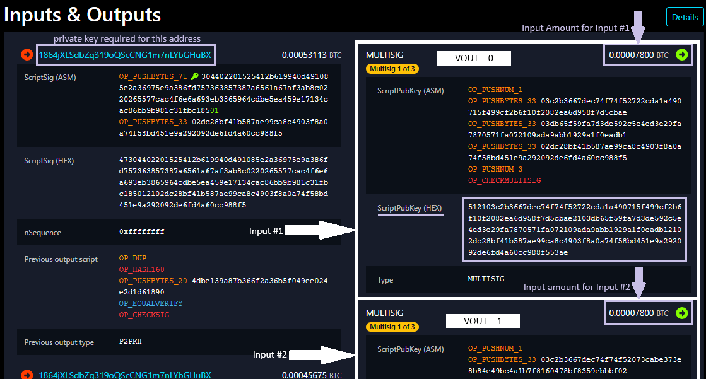
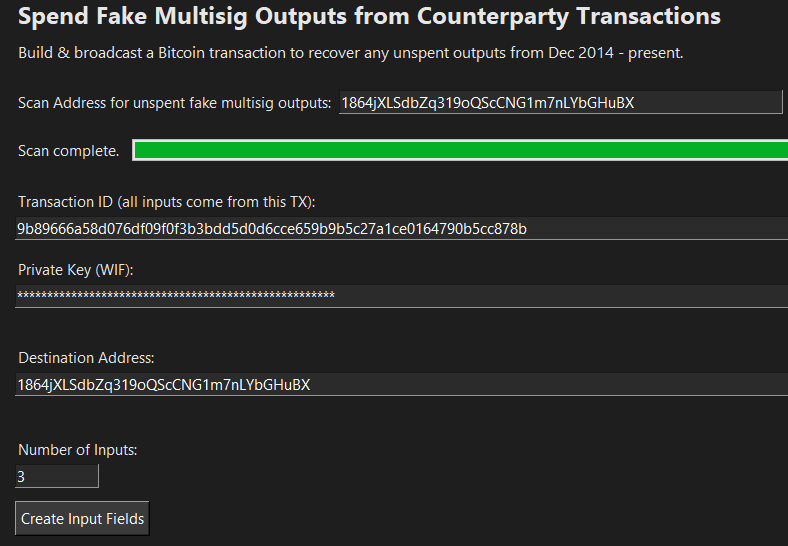
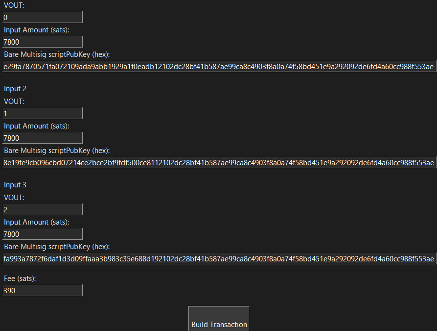
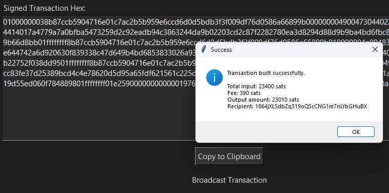
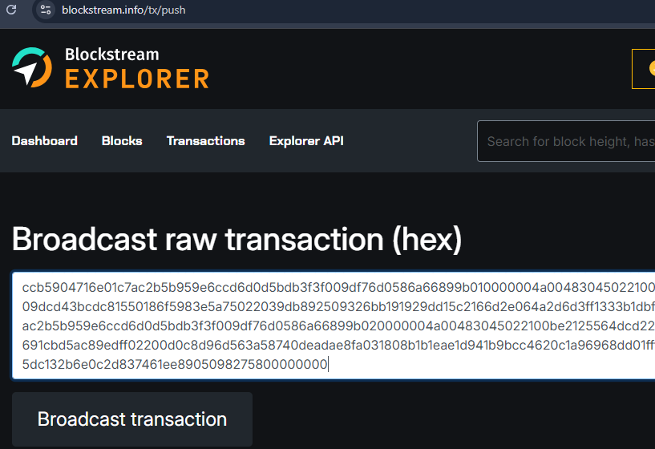

# OutputSpender

A GUI tool for recovering fake multisig outputs generated by Counterparty transactions (Dec 2014–present).

This utility was created to help Counterparty users redeem "hidden" outputs that aren't recognized by most Bitcoin wallets. Transactions with such outputs are created by the Counterparty protocol to store a larger amount of data than the usual OP_RETURN method will allow. 

These outputs are erroneously labeled as MULTISIG in block explorers like mempool.space; thus their transactions are often referred to as "fake multisig". This type of MULTISIG output is spendable only through manually-constructed transactions, which is what this program helps you build and broadcast.

## Features

- Scan any Bitcoin address for unspent fake multisig outputs
- Build and sign raw Bitcoin transactions
- Export signed hex for broadcast
- Fully offline signing supported

## Installation

OutputSpender is currently available for Windows only. Download the latest release from the Releases page. To build from source:

python -m PyInstaller --onefile --windowed OutputSpender.py

You can also download the latest OutputSpender.exe from the Releases page. No installation required — just run the executable.

## Usage

Instructions

Step 1. Enter a Bitcoin address to scan for transactions with fake multisig outputs (specific to Counterparty transactions). The scan will check your address history and return a list of transaction IDs with unspent multisig outputs. Be patient as this process can take several minutes for addresses with large transaction histories.

Step 2. Double-click on a transaction ID for one of these transactions to open its corresponding tx page on mempool.space. Scroll down the page and click the "Details" button to the right of "Inputs & Outputs". This will expand the information to include the fields you need to create your spend transaction:

 - Transaction ID (txid): the string after "/tx/" in the browser address bar
 - Amount: sats in output, to the right of "MULTISIG" in the output area
 - ScriptPubKey (HEX): a long string of characters immediately below "ScriptPubKey (ASM)" in the output area
 - VOUT: the position of the output in its transaction (1st position: VOUT = 0, 2nd position: VOUT = 1, 3rd position: VOUT = 2, etc.)

Step 3. Locate the VOUT and ScriptPubKey for each output you want to spend.

You will also need:

- Private key of the scanned address
- Bitcoin address to which you want to send BTC

Step 4. Enter the transaction ID, private key, and number of inputs (total number of outputs to be spent from the same transaction ID). After double-checking everything is correct, press "Create Input Fields".

Step 5. Enter the necessary data for each input:

 - VOUT: 1st output VOUT = 0; 2nd output VOUT = 1, 3rd output VOUT = 2, etc.
 - Input Amount (sats): amount of the output
 - Bare Multisig scriptPubKey (hex): long string of digits below "ScriptPubKey (ASM)"

A recommended transaction fee of slightly >1 sat/byte will be applied, but can be customized by the user (minimum of 100 sat per input strongly recommended). After double-checking to make sure everything is correct, press "Build Transaction".

Step 6. If everything went according to plan, you should see a popup that says "Transaction built successfully. Fee = (Total Amount - Total Spend Amount). Output amount = (Total Spend Amount)." Press the "Copy to Clipboard" button under Signed Transaction Hex. 

Step 7. You are now ready to broadcast the transaction to the Bitcoin network. Press the "Broadcast Transaction" link below the "Copy to Clipboard" button. This will bring you to Blockstream's transaction broadcast service. Paste your transaction hex into the box and press "Broadcast transaction". 

You will then be brought to the block explorer entry for your new transaction which will await confirmation in the mempool. 

If you get a message that says "Transaction not found", simply refresh the page. This means your broadcast was successful but the transaction page had not been created yet. If it says any other error message, double-check your fields as something is wrong in the construction of your transaction (forgetting to update the txid is the most common issue).

## Notes

- This method will work for any unspent fake multisig outputs created by Counterparty transactions from Dec 2014 to the present. Outputs from Counterparty transactions before this date may not be spendable.
- STAMPS Creators should cross-reference transaction IDs with their Counterparty Stamp issuances if they wish to avoid spending these outputs.
- Only supports Bitcoin mainnet.

## Security Warning

⚠️ Never share your private key with anyone.  
⚠️ Always verify the executable checksum before running.  
⚠️ Use this tool at your own risk.

Best security practices for using OutputSpender:

 - empty the address you wish to spend fake multisig outputs from first, 
 - build the transactions offline,
 - close OutputSpender before going back online,
 - broadcast your pre-built transactions after going back online.

## License

MIT License

## Credits

Created by nutildah (nutildah@dogermint.com)

## Support the Project

If this tool helped you recover funds, consider supporting development:

**BTC:** `bc1qza7kyd89567rr2n8alazy00h9hj065fved7gvy`
